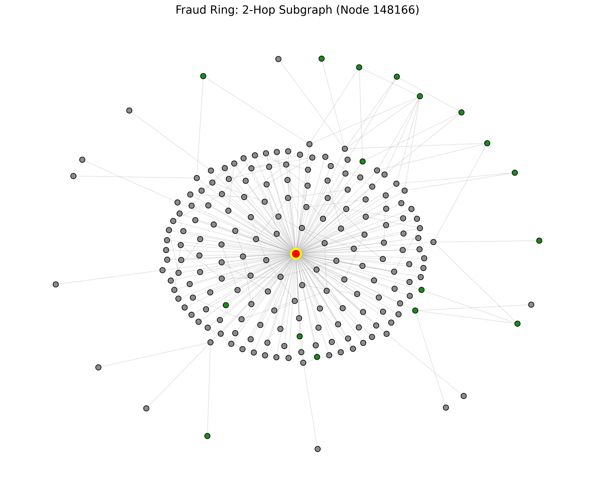

# 🚨 Cryptocurrency Fraud Ring Detection via Graph Neural Networks


## 📌 Business Context

Cryptocurrency is frequently used for illicit activities, including ransomware payouts and darknet market transactions. To avoid detection, criminals use a technique called **layering** (or peeling chains), where stolen funds are bounced across dozens of intermediary wallets before being cashed out at a regulated exchange.

Traditional tabular machine learning models often fail to detect this because they ignore network topology. This project implements a **Graph Neural Network (GraphSAGE)** to analyze the shape, structure, and connections of the Elliptic Bitcoin dataset, actively hunting for money laundering subgraphs.

## 🕸️ Network Topology Visualization

*(Below is a 2-hop transaction neighborhood surrounding a highly connected illicit node. Red = Fraudulent, Green = Licit, Gray = Unknown).*



## ⚙️ Engineering & MLOps Architecture

This project is built as a production-ready MLOps pipeline, moving beyond static Jupyter notebooks:

1. **Model:** `SAGEConv` (GraphSAGE) built with PyTorch Geometric to dynamically sample and aggregate local network neighborhoods.
2. **Experiment Tracking:** **MLflow** is integrated into the training loop to automatically log hyperparameters, F1-scores, Recall, and model artifacts.
3. **Data Versioning:** **DVC** handles the 200MB+ of raw graph data and `.pt` weights, keeping the Git repository lightweight.
4. **Model Serving:** A **FastAPI** REST endpoint loads the weights into memory on startup and validates incoming subgraph JSON payloads using Pydantic.
5. **Containerization:** The entire inference API is packaged in a **Docker** container for one-click deployment.

## 🚀 Quick Start (Running the API)

### 1. Clone and Pull Data

Because the heavy dataset and model weights are tracked by DVC, you will need to pull them after cloning the repository (requires AWS/GCP access if configured, or local `.dvc` tracking):

```bash
git clone [https://github.com/YourUsername/fraud-gnn-detection.git](https://github.com/YourUsername/fraud-gnn-detection.git)
cd fraud-gnn-detection
dvc pull
```

### 2. Run via Docker

The easiest way to run the inference server is via Docker:

```
docker build -t fraud-gnn-api .
docker run -p 8000:8000 fraud-gnn-api
```

### 3. Test the Endpoint

Once the server is running, navigate to `http://127.0.0.1:8000/docs` to use the built-in Swagger UI to ping the `/predict` endpoint with a subgraph JSON payload.

## 📊 Training the Model Locally

To run the MLflow tracking pipeline and train the model from scratch:

```
# Install dependencies
pip install -r requirements.txt
pip install mlflow dvc

# Run the training script
python src/train.py

# View the tracking dashboard
mlflow ui
```
