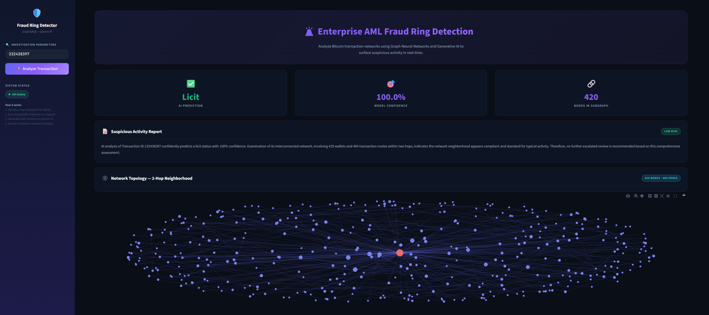
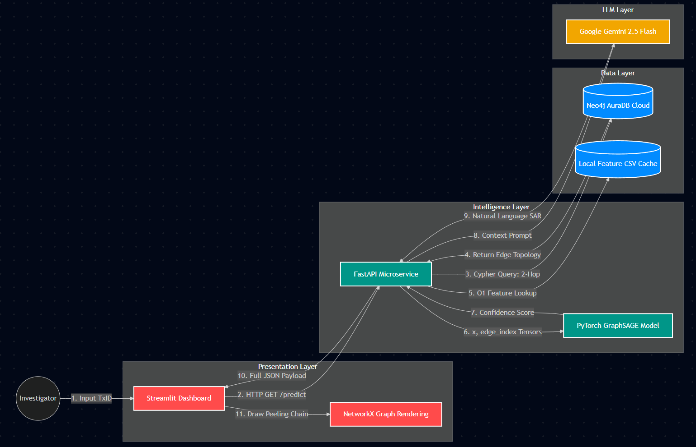

# 🚨 Enterprise AML Fraud Ring Detection: GNN + LLM Pipeline

[](https://github.com/vyom-nikhra/fraud-gnn-detection/actions/workflows/ci.yml)


An enterprise-grade Anti-Money Laundering (AML) system that moves beyond traditional tabular machine learning. By leveraging Graph Neural Networks (GraphSAGE) to analyze cryptocurrency peeling chains and LLMs (Google Gemini) to generate compliance reports, this system detects illicit financial networks in real-time.


*Above: The Streamlit dashboard visualizing a 2-hop transaction network, with a dynamically generated Suspicious Activity Report (SAR).*

---

## 🧠 The Architecture

This project is built using a modern, decoupled microservice architecture, spanning four distinct layers:



1. **The Data Layer (Neo4j AuraDB):** The Elliptic Bitcoin dataset (~200,000 nodes/edges) was ingested into a live cloud graph database to maintain strict relational topology, utilizing a local feature store for O(1) attribute lookups.
2. **The Intelligence Layer (FastAPI + PyTorch + Gemini):** A REST API serves as the central brain. It dynamically queries Neo4j for 2-hop neighborhood graphs, converts them to tensors, and runs a forward pass through a custom GraphSAGE neural network. The topology metrics and confidence scores are then passed to Google Gemini 2.5 Flash to generate a human-readable Suspicious Activity Report (SAR).
3. **The Presentation Layer (Streamlit):** An interactive, glassmorphism-styled dashboard for compliance officers. It visualizes the queried transaction network using interactive Plotly NetworkX graphs, allowing investigators to pan, zoom, and hover over specific nodes to analyze routing degrees and layering behaviors.
4. **The MLOps Layer (DVC, MLflow, & GitHub Actions):** Heavy `.pt` model weights and `.csv` feature stores are version-controlled via DVC. Model training experiments, hyperparameters, and evaluation metrics (F1-score, accuracy) are systematically logged using MLflow. The CI/CD pipeline runs automated Pytest checks on the FastAPI server before every merge.

---

## 🛠️ Tech Stack

* **Machine Learning:** PyTorch, PyTorch Geometric (GraphSAGE)
* **Generative AI:** Google Gemini SDK
* **Database & APIs:** Neo4j (Cypher), FastAPI, Uvicorn
* **Frontend:** Streamlit, NetworkX, Plotly (Interactive Graphing), Custom CSS
* **MLOps:** DVC, MLflow, GitHub Actions, Pytest

---

## 🚀 Getting Started

### 1. Clone the Repository

```bash
git clone https://github.com/vyom-nikhra/fraud-gnn-detection.git
cd fraud-gnn-detection
```

### 2. Environment Setup

Create a `.env` file in the root directory and add your credentials:

```bash
NEO4J_URI=neo4j+ssc://your-instance.databases.neo4j.io
NEO4J_USERNAME=neo4j
NEO4J_PASSWORD=your_password
LLM_API_KEY=your_google_gemini_key
```

### 3. Install Dependencies & Pull Weights

```bash
python -m venv venv
source venv/bin/activate  # On Windows use: venv\Scripts\activate
pip install -r requirements.txt
dvc pull  # Pulls the heavy model weights and feature CSVs
```

### 4. Run the Microservices

Start the FastAPI Backend:

```bash
uvicorn api.main:app --reload
```

Start the Streamlit Frontend (in a new terminal):

```bash
streamlit run frontend/app.py
```

### 5. Reproducing & Tracking Experiments (Optional)

If you wish to train a new GraphSAGE model from scratch or review the historical hyperparameter tuning that led to the current production weights, you can use the MLflow UI:

```bash
# To train a new model:
python src/train.py

# To view the training history and metrics:
mlflow ui
```

---

## Author

**Vyom Nikhra** B.Tech Data Science & AI, Indian Institute of Information Technology, Sri City

[LinkedIn](https://www.linkedin.com/in/vyom-nikhra/) | [GitHub](https://github.com/vyom-nikhra)
